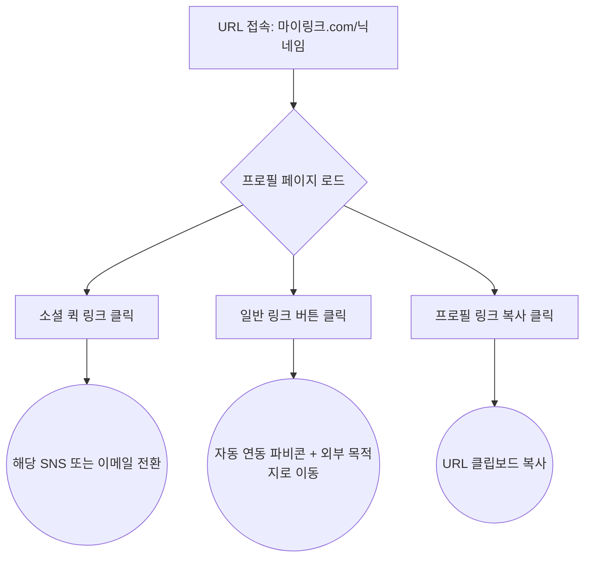
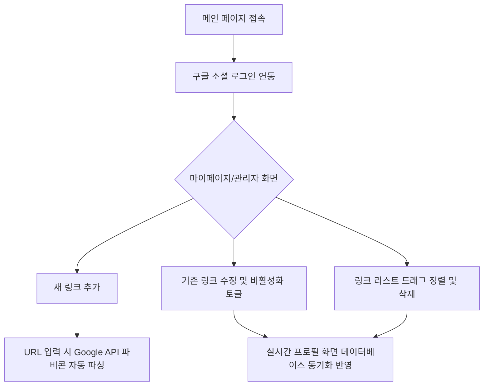

# 마이링크 (MyLink) 와이어프레임 및 흐름도 (Wireframes & Flow)

## 1. 아키텍처 및 사용자 흐름 (Mermaid)

### 1-1. 방문자 (Visitor) 이용 흐름도
방문자가 마이링크 URL에 접속하여 수행할 수 있는 주요 행동 흐름입니다.



### 1-2. 소유자 (Owner) 관리 흐름도
소유자가 로그인 후 링크를 관리하는 제어 흐름입니다.



---

## 2. 모바일 화면 와이어프레임 (ASCII Art Style)
마이링크는 '모바일 반응형 웹'을 최우선으로 설계되므로 스마트폰 세로 화면을 기준으로 작성되었습니다.

### 2-1. 방문자 화면 (Visitor View)
방문자가 접속했을 때 보게 되는 깔끔한 프로필 페이지입니다.

```text
+-----------------------------------+
|                         [공유하기]|
|                                   |
|            [ 닉 내 임 ]           |
|      "프론트엔드 포트폴리오"      |
|                                   |
|      (IG)  (YT)  (GH)  (EM)       |
|                                   |
|   +---------------------------+   |
|   | (M)  미디엄 블로그 방문   |   |
|   +---------------------------+   |
|   +---------------------------+   |
|   | (G)  최신 프로젝트 코드   |   |
|   +---------------------------+   |
|   +---------------------------+   |
|   | (Y)  리액트 튜토리얼 영상 |   |
|   +---------------------------+   |
|                                   |
|         powered by MyLink         |
+-----------------------------------+
```
* **(M), (G), (Y)**: 자동 연동되어 표시되는 타겟 URL의 파비콘 영역입니다.
* **(IG), (YT)** 등: 공간을 절약하는 소셜/연락망 퀵 링크 아이콘입니다.

### 2-2. 소유자 관리자 화면 (Admin Dashboard View)
소유자가 구글 로그인 후 접속하는 관리(에디터) 페이지입니다.

```text
+-----------------------------------+
| [로그아웃]            [내 프로필>]|
|                                   |
|  * 닉네임: [ 닉내임           ]   |
|  * 소개글: [ 프론트엔드 포트..]   |
|                                   |
|        [ + 새로운 링크 추가 ]     |
|                                   |
| ================================= |
|  [≡] (M) 미디엄 블로그 방문   [x] |
|       URL: [ http://medi.. ]      |
|       노출: ( ON )                |
| --------------------------------- |
|  [≡] (G) 최신 프로젝트 코드   [x] |
|       URL: [ http://gith.. ]      |
|       노출: ( OFF )               |
| ================================= |
|                                   |
+-----------------------------------+
```
* **[≡]**: 드래그 앤 드롭을 위해 잡고 끄는 공간(Drag Handle)입니다.
* **[x]**: 링크 영구 삭제(휴지통) 버튼입니다.
* **노출 (ON/OFF)**: 링크 항목을 살려둔 채 일시적으로 방문자 화면에서 숨기는 토글입니다.
